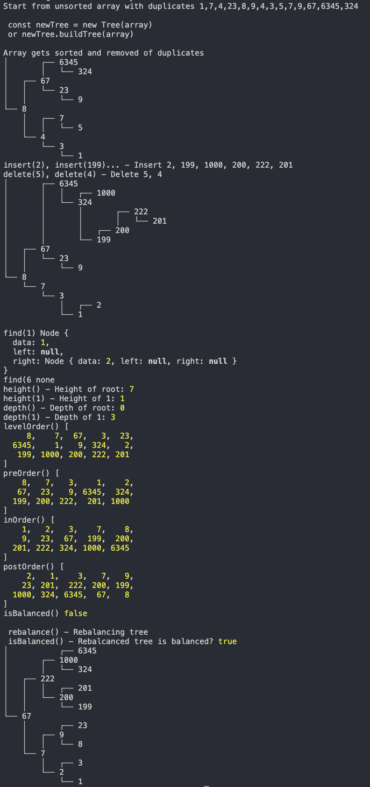

# Binary Search Tree

Using vanilla JS to create binary search tree

Includes the following methods:

- `insert(value)` - inserts a new node with the given value into the tree
- `delete(value)` - removes the node holding the given value from the tree
- `minValue(node)` - finds the smallest value in the given node (uses root if no value given)
- `find(value)` - returns the node holding the given value in the tree
- `height(value)` - returns the height of a given node (uses root if no value given)-- defined as the longest path between the node and a leaf node
- `depth(value)` - returns the depth of a given node (uses root if no value given) -- defined as the distance between the node and the root
- `levelOrder()` - traverses each node of the tree in level order
- `inOrder()` - traverses each node of the tree in-order
- `preOrder()` - traverses each node of the tree pre-order
- `postOrder()` - traverses each node of the tree post-order
- `isBalanced()` - returns true/false based on whether or not the tree is balanced
- `rebalance()` - rebalances the tree
- `prettyPrint` - prints the tree in the console in a human reader friendly format

## Example images

